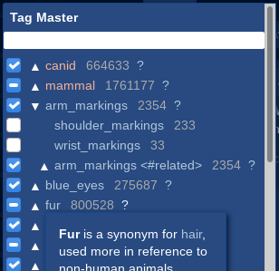

# Tag Master

Tagging helper for e621 (and e926) featuring:

- Searching tags using a data set stored in the browser.
- Automatic tag alias resolution and knowledge of tag implications.
- Tag usage counts and wiki snippets for all known tags.
- Endless tree of related tags using wiki data.
- Browsable tag groups.
- Regex tag search.




## Installation

Tag Master is a userscript that runs in your browser using an extension.

1. Install a userscript manager (for example [Tampermonkey](https://www.tampermonkey.net/)).
2. Install [Tag Master](https://github.com/pxlAurora/TagMaster/releases/latest/download/tagMaster.user.js). With most managers clicking on the link and approving installation of the script should be enough.
3. Verify that the script works by attempting to edit post tags or using the upload page (both require being logged in).
4. On first use you will be asked to review the settings. Do so, then click the "Save" button at the bottom.

### Updating

The userscript manager should download updates automatically, with frequency depending on its configuration. Because Tag Master relies on the resource (aka externals) system of userscripts, this may be different than the update frequency of userscripts. In case of Tampermonkey the default is every 7 days.

Tag data updates are checked at least 24 hours after the last check, as soon as Tag Master is opened.


## Usage

Tag Master will automatically open when a tag input is shown.

Use the search bar at the top of the popup to find tags. Click a checkbox next to a tag to add or remove it. If a tag is implied by one of the added tags, the checkbox will appear in a third state.

If the search bar is empty, the list below it will show currently added tags.

Click on a tag or the arrow next to it to expand or collapse a list of related tags. For tags, the list will contain tags that imply it and a tag group of related tags (if one exists). For tag groups, the list will show its tags grouped by category.

The search bar also supports some shortcuts:

- `#` followed by text to search through tag groups.
- `##` to show the `#index` tag group.
- `#+` followed by text to show the entered text as a tag list (useful for tagging sets).
- `/` followed by text to use regex.
- `@` to show the top 500 most popular tags.

Hover over a question mark next to a tag to show a snippet of its wiki page. Click the question mark to visit the wiki page.


## Development (for nerds)

First, install dependencies:

```sh
npm install
```

Next, obtain a copy of the tag data and put it under `data/tags.json`. You can download one from [here](https://github.com/pxlAurora/e621-tag-data/releases/latest).

You can develop in standalone mode, which puts the tagger on a dummy page with HMR enabled:

```sh
npm run standalone-dev
```

Or in userscript mode without HMR for testing as an actual userscript. This works with the [`tagMaster.user.dev.js`](http://127.0.0.1:8080/tagMaster.user.dev.js). Running in this mode may require manually purging the userscript resource cache on every update:

```sh
npm run dev
```
